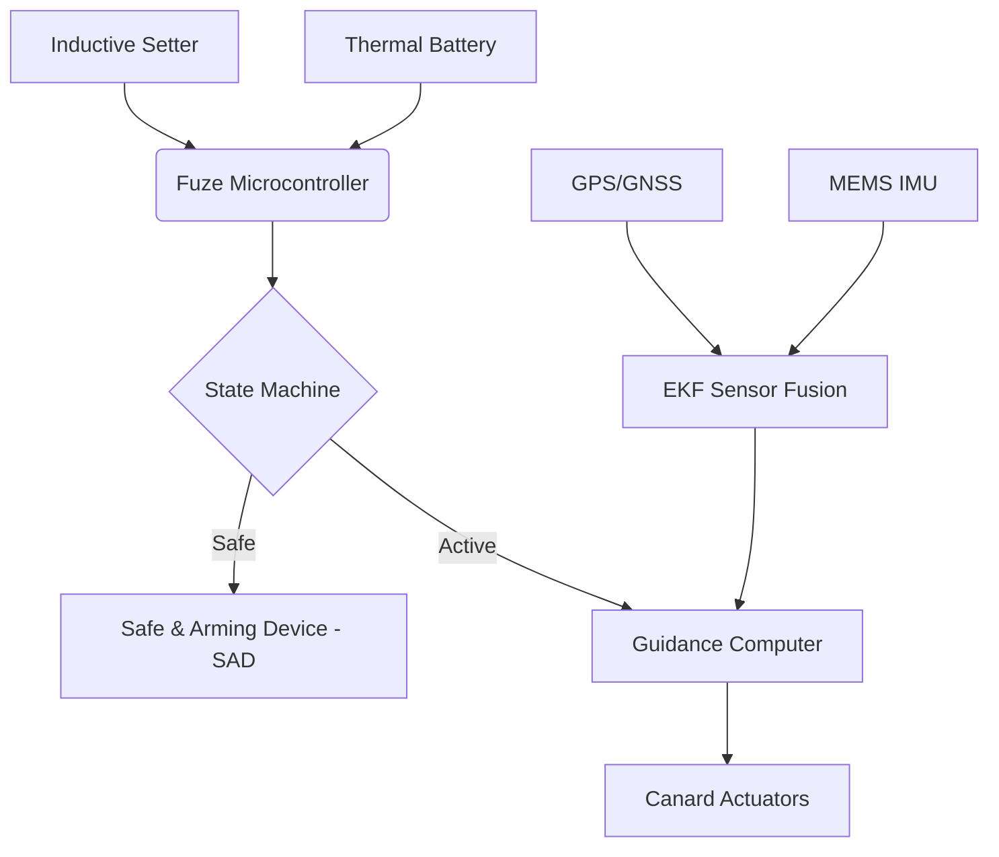

# PGK System Architecture

## 1. System Overview
The Precision Guidance Kit (PGK) and Smart Multi-Mode Electronic Fuze Demonstrator is designed for 155mm artillery shells. It replaces the standard fuze, providing GPS/INS guidance and multi-mode detonation (Point Detonation, Delay, Proximity/Height of Burst) to reduce Circular Error Probable (CEP) from ~150-200m to <30m.

### Block Diagram

## 2. Form Factor
- **Dimensions:** Compatible with NATO standard fuze well (2-inch 12-UNS-2B thread, 51.1mm diameter).
- **Mass:** ~1.4 kg
- **Shell Reference:** 155mm, 43.2 kg, Caliber 0.155 m, Ref Area ≈ 0.01887 m².

## 3. Mechanical Design
- **De-spin Bearing:** Isolates the forward canard section (rolling slowly or fixed) from the main shell body (spinning at ~250 rev/s).
- **Canards:** 4 independently or differentially driven surfaces. Deflection limits: ±15°, Slew rate: 300°/s.

## 4. Electronics Architecture
- **MCU:** STM32H7 series or high-reliability FPGA.
- **IMU:** High-G tolerant MEMS (e.g., ADIS16490). Noise modeled as white Gaussian + bias.
- **GPS:** Fast acquisition receiver. Noise σ ≈ 1.5–2.5 m.
- **EKF:** 6-state minimum filter `[x, y, z, vx, vy, vz]`.

## 5. SWaP-C Breakdown
| Subsystem | Size (cm³) | Weight (g) | Power (W) | Cost ($ at scale) |
|---|---|---|---|---|
| Guidance Electronics | 50 | 150 | 2.5 | 1200 |
| Actuation System | 150 | 450 | 12.0 (peak) | 1500 |
| Sensors (IMU/GPS) | 40 | 100 | 1.0 | 800 |
| Power (Thermal Batt)| 100 | 250 | - | 400 |
| Fuze / SAD | 80 | 400 | 0.5 | 600 |
| **Total** | **420** | **1350** | **16.0** | **$4500** |

## 6. Power System
- **Primary Source:** Lithium-Iron Disulfide (Li-FeS2) thermal battery.
- **Activation:** Setback shock (15,000g) ignites the pyrotechnic heat source.
- **Backup:** Supercapacitors for temporary holdup during high-G transients.

## 7. Communication
- **Pre-fire:** Inductive fuze setter interface compliant with STANAG 4369 / MIL-STD-1760. Used for loading target coordinates, GPS keys, and fuze mode.

## 8. Environmental Specifications
| Parameter | Specification |
|---|---|
| Operating Temp | -40°C to +60°C |
| Storage Temp | -55°C to +71°C |
| Setback Shock | 15,000g - 20,000g for 10ms |
| Spin Rate | Up to 300 rev/s |

## 9. Compliance Matrix
- **MIL-STD-1316:** Fuze safety design requirements.
- **STANAG 4187:** Fuzing systems safety requirements.
- **AOP-21:** Environmental testing.
